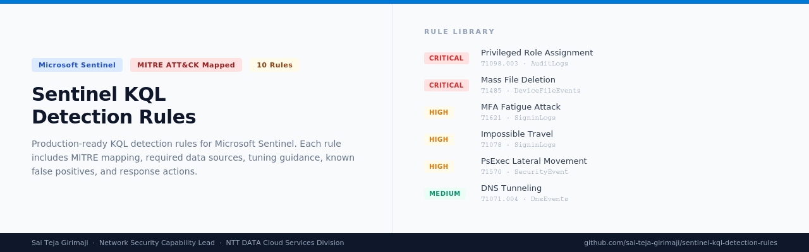

# Microsoft Sentinel KQL Detection Rules

> Production-ready KQL detection rules for Microsoft Sentinel, organized by MITRE ATT&CK tactic

  
  
  
  

---

## Purpose

This repository contains production-tested KQL detection rules for Microsoft Sentinel. Each rule includes the query, MITRE ATT&CK mapping, required data sources, tuning guidance, known false positives, and recommended response actions.

Rules are written by a practitioner for practitioners. No vendor marketing. No theoretical detections. Every rule reflects real attacker behavior and real operational tuning requirements.

---

## Rule Index

| File | Technique | Tactic | Severity | Data Source |
|---|---|---|---|---|
| [T1110-brute-force-signin.md](./T1110-brute-force-signin.md) | T1110 - Brute Force | Credential Access | High | SigninLogs |
| [T1621-mfa-fatigue.md](./T1621-mfa-fatigue.md) | T1621 - MFA Request Generation | Credential Access | High | SigninLogs |
| [T1078-impossible-travel.md](./T1078-impossible-travel.md) | T1078 - Valid Accounts | Initial Access | High | SigninLogs |
| [T1059-powershell-encoded-command.md](./T1059-powershell-encoded-command.md) | T1059.001 - PowerShell | Execution | High | DeviceProcessEvents |
| [T1570-psexec-lateral-movement.md](./T1570-psexec-lateral-movement.md) | T1570 - Lateral Tool Transfer | Lateral Movement | High | SecurityEvent |
| [T1136-new-local-admin-creation.md](./T1136-new-local-admin-creation.md) | T1136.001 - Local Account | Persistence | High | SecurityEvent |
| [T1098-privileged-role-assignment.md](./T1098-privileged-role-assignment.md) | T1098.003 - Additional Cloud Roles | Privilege Escalation | Critical | AuditLogs |
| [T1485-mass-file-deletion.md](./T1485-mass-file-deletion.md) | T1485 - Data Destruction | Impact | Critical | DeviceFileEvents |
| [T1578-azure-mass-resource-deletion.md](./T1578-azure-mass-resource-deletion.md) | T1578.003 - Delete Cloud Instance | Impact | Critical | AzureActivity |
| [T1071-dns-tunneling.md](./T1071-dns-tunneling.md) | T1071.004 - DNS | Command and Control | Medium | DnsEvents |

---

## Data Source Requirements

| Data Source | Connector Required | License |
|---|---|---|
| SigninLogs | Azure Active Directory connector | Azure AD P1 or P2 |
| AuditLogs | Azure Active Directory connector | Azure AD P1 or P2 |
| SecurityEvent | Windows Security Events connector | Any |
| DeviceProcessEvents | Microsoft Defender for Endpoint connector | MDE Plan 1 or 2 |
| DeviceFileEvents | Microsoft Defender for Endpoint connector | MDE Plan 1 or 2 |
| AzureActivity | Azure Activity connector | Any (free) |
| DnsEvents | DNS Analytics solution | Log Analytics workspace |

---

## How to Deploy a Rule to Sentinel

1. Go to **Microsoft Sentinel** in the Azure portal
2. Navigate to **Analytics** and click **Create** and select **Scheduled query rule**
3. Fill in the rule name, description, and severity from the rule file
4. Paste the KQL query into the **Set rule logic** section
5. Set the **Query frequency** and **Lookup data** period as noted in each rule file
6. Configure alert grouping and automated response as needed
7. Review and create

---

## Tuning Philosophy

Every rule ships with conservative default thresholds. Tune them down if your environment has low noise. Tune them up if you are seeing too many false positives.

Never deploy a rule directly to production without first running it in **Simulation mode** or reviewing historical results using **Test with current data** in the analytics rule editor.

---

## MITRE ATT&CK Coverage Map

See [MITRE-Coverage.md](./MITRE-Coverage.md) for the full coverage matrix.

---

## Author

**Sai Teja Girimaji**
Network Security Capability Lead, NTT DATA Cloud Services Division

[LinkedIn](https://www.linkedin.com/in/girimaji-saiteja-569b356a) | [Portfolio](https://saiteja-security.netlify.app) | [AI Security Governance Framework](https://github.com/sai-teja-girimaji/ai-security-governance-framework)

---

*Rules are reviewed and updated as new attacker techniques emerge and Sentinel schema changes are released.*
